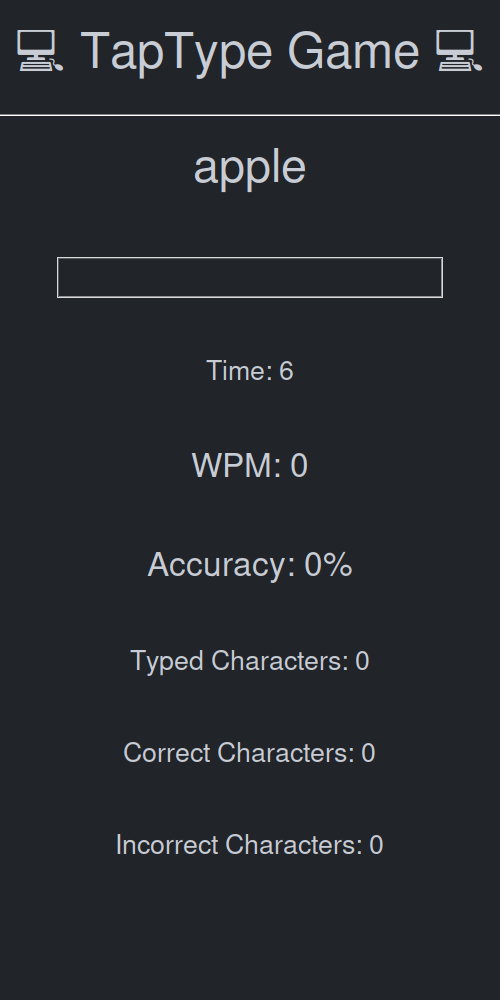

# 💻 TapType Game 💻
A typing game to test your typing speed and accuracy.

## 📋 Features 📋
* Test your typing speed and accuracy.
* Easy to use UI.
* Built-in timer to track your progress.

## 📌 To-Do List 📌
- [ ] Update background image - make custom one to fit all of the fields
- [ ] Add different levels of difficulty
- [ ] Add a scoreboard to track best scores
- [ ] Add more words to the `words.txt` file
- [ ] Add more features to the UI

## 🛠 Installation 🛠
1. Download the repository from GitHub.
2. Install the necessary modules: `tkinter`, `pygame`.
3. Download the `text.txt` file from the repository.
4. Run the `main.py` file.

## 📖 Documentation 📖
See the `README.md` file for more information.

## 📃 License 📃
This project is licensed under the terms of the MIT license. See the `LICENSE` file for more information.

